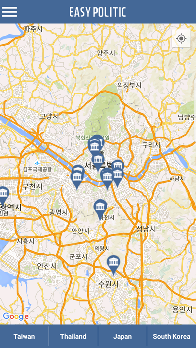
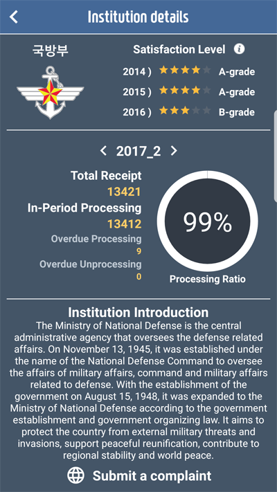
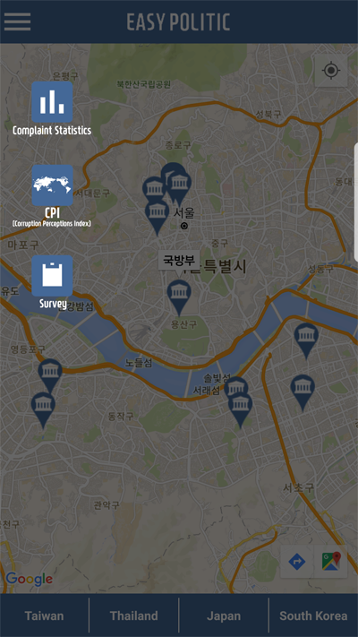
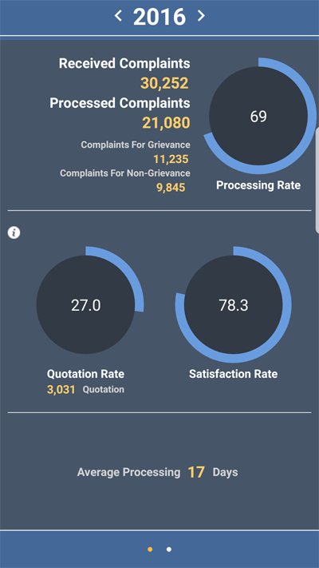
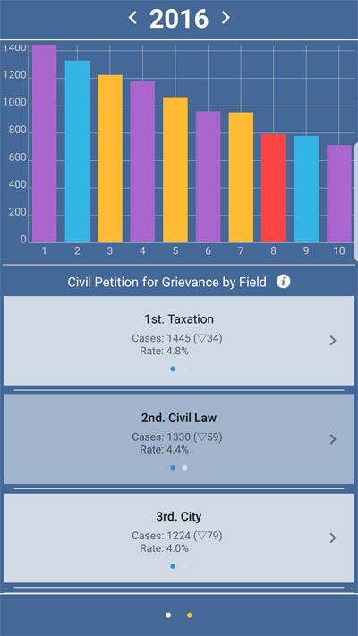
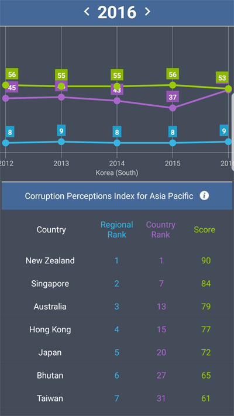
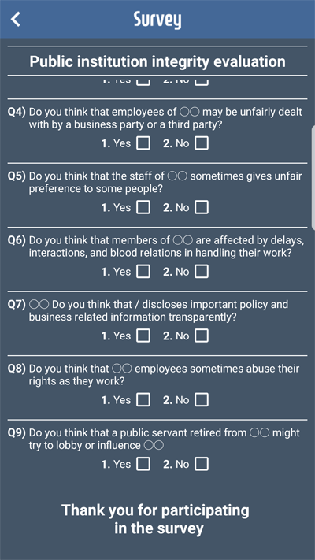

# 2017 Asia Open Data Hackathon(Prototype)

  <a href="https://www.youtube.com/watch?v=MgGlH5tvWJY">
  
 </a>

## 0. Team 
>**Team**  
> ● CrossIt 
>**Project**  
> ● EasyPolitic 
>**Member** 
> ● Kim SungJae, Shin YunHee, Yoo TaeYang, Lee HyunBeen 

 

  
   
  <b>[Result]</b>

 

## 1. Introduce

>**Subject :**  How can public data be used for government transparency? 
>
>**Problem & Solution :**  The government has many affiliated organization. And without interesting, it is difficult to know whether these institution manage their’s work transparently. We agonized how to use open datas for the ‘government transparency’. So we use open datas related to ‘civil complaints’ which is a kind of government processing, and put the results into prototype application. 

## 2. Function

 

  
  
   
  <b>[Main]</b>

 

>We can easily find information about public institutions in Taiwan, Thailand, Japan and Korea. 
>Based on Open Data, we can check the satisfaction rate of public institutions, quarterly civil service transactions, and public institutions information 
> 
>**Summary** 
> 
>**1.** Providing information about the satisfaction level of civil petitions in the year of public institutions 
>**2.** Provide information on quarterly civil petitions processing rate of public institutions 
>**3.** Providing Information on Public Institutes 
>**4.** Providing a method to easily submit civil petitions to public institutions 

 

  
   
  <b>[Menu]</b>

 

> The menu provides a variety of information about complaints 

 

  
  
   
 <b>[Complaint Statistics]</b>

 

> Provides statistics for all complaints processing. 
>  
>**Summary** 
> 
>**1.** Provide statistics on complaint handling by year. 
>**2.** Provide quotations of public institutions 
>**3.** Provide satisfaction of processing complaints of public institutions 
>**4.** Provide information on the average complaint processing date 
>**5.** Provide statistics on complaints received by sector 

 

  
   
   <b>[Corruption Perceptions Index]</b>

 

> Provide statistical information on CPI(Corruption Perceptions Index) 
>  
> **Summary** 
> **1.** Provides ranking and score statistics for CPI by country 

 

  
   
   <b>[Servey]</b>

 

>Provide surveys to easily accept citizens' opinions 

## 3. Objective

 

  
   

 

>Using open data, data related to transparency of various organizations is shown more intuitively using the application. So users can get access to government transparency easily. and you can expect immediate feedback using content such as survey.

## 4. Open Data List

> 1. Compliance Rate of Processing Period for Complaints 
https://www.data.go.kr/dataset/3070147/fileData.do 
>
>2. Status of Civil Petition for Grievance by Year and Field 
https://www.data.go.kr/dataset/3070243/fileData.do 
>
>3. Satisfaction Evaluation of Complaints  
http://www.acrc.go.kr/ 
>
>4. Corruption Perceptions Index by Country 
https://www.transparency.org/news/feature/corruption_perceptions_index_2016 
>
>5. Survey for Integrity evaluation of public institution 
http://www.acrc.go.kr/acrc/board.do?command=searchDetail&menuId=05020703 

 
 

  <a href="https://github.com/PuzzleLeaf/EasyPolitic/raw/master/ppt/EasyPolitic.pptx">
  
 </a> 
  <b>DownLoad PPT</b>

 

 

  <a href="https://github.com/PuzzleLeaf/EasyPolitic/raw/master/install/EasyPolitic.apk">
  
 </a> 
  <b>[DownLoad EasyPolitic]</b>

